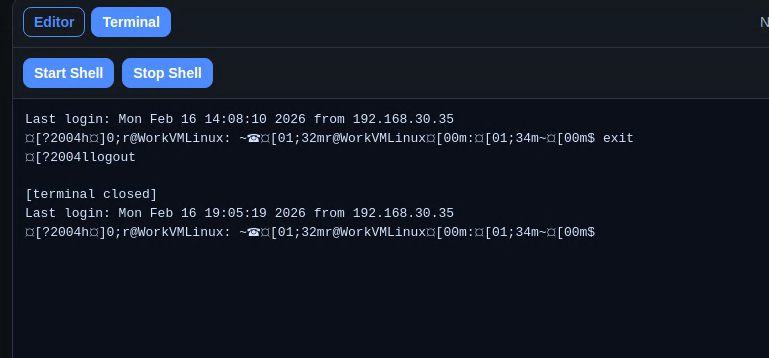

# SSH Lite Client (MVP)

Windows-first desktop app for quickly editing config files and scripts over SSH/SFTP.



## Motivation

This project exists to make remote Linux edits fast and low-friction for day-to-day tasks like updating Raspberry Pi configs or small scripts.

The goal is to avoid the heavy startup and workflow overhead of full IDE remote tooling while still keeping the core capabilities in one place:

- quick SSH connection
- fast remote file browse/open/save
- lightweight built-in editor
- basic terminal access when needed

In short: optimize for speed and simplicity, not full IDE complexity.

## Current MVP features

- SSH connect with password or pasted private key
- Private-key file picker
- Remote directory browsing
- Open remote files
- Edit and save remote files
- Basic interactive SSH terminal pane
- Saved connection profiles (name/host/port/user/start path)
- Host key trust flow with saved fingerprints
- Lightweight single-window UI

## Run

```bash
npm install
npm run dev
```

## Package (Windows installer)

```bash
npm install
npm run package:win
```

Installer output goes to `release/` (for example `SSH Lite Client-0.1.0-Setup-x64.exe`).

## CI build workflow

- Workflow file: `.github/workflows/windows-build.yml`
- Trigger:
  - push to `main`
  - manual run via GitHub Actions (`workflow_dispatch`)
- Output:
  - downloadable Windows `.exe` artifact named `ssh-lite-client-windows`

## Notes

- This first version is intentionally minimal and optimized for speed.
- Profiles and trusted host fingerprints are stored in Electron app data.
- Packaging currently builds unsigned installers (expected for MVP).
- Terminal output is currently normalized to plain text (ANSI/control sequences stripped) for MVP readability.
- Planned pipeline item (later): upgrade terminal pane to true interactive terminal (xterm.js).
- Next steps: key-agent support, safer privileged writes, and code signing.
