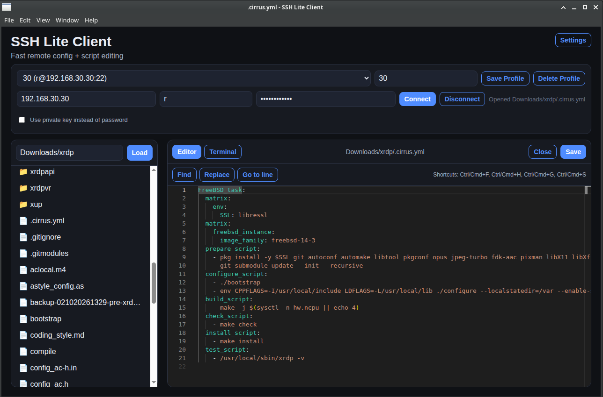

# SSH Lite Client

Windows-first desktop app for quickly editing config files and scripts on remote Linux machines over SSH/SFTP.

## Why this exists

Sometimes you just want to SSH into a Linux box (Raspberry Pi, home server, VM, etc.) and quickly edit a config file or a small script.

VS Code Remote SSH can do this, but for quick edits it can feel heavy:
- slower startup
- multiple setup/login steps
- more IDE overhead than needed for small maintenance changes

WinSCP is usually faster for file access, but it does not provide the same built-in editing flow this app is aiming for.

SSH Lite Client is built for that quick-fix workflow:
- connect fast
- browse files fast
- open/edit/save in one lightweight app
- optional terminal when needed

## Install (Windows)

1. Go to the project’s **Releases** page on GitHub.
2. Download the latest installer:
   - `SSH Lite Client-<version>-Setup-x64.exe`
3. Run the installer.
4. Open **SSH Lite Client** from Start Menu/Desktop.

## First-time use

1. Enter host, port, username, and password (or load a private key).
2. Click **Connect**.
3. If prompted, verify and trust the host fingerprint.
4. Browse files on the left, open/edit on the right, and click **Save**.

## Optional: Save a profile

- Fill connection details
- Enter a profile name
- Click **Save Profile** for quick reconnects later

## Current features

- SSH connection with password or private key content
- Private key file picker
- Host key trust confirmation + saved trusted fingerprints
- Saved connection profiles (name, host, port, username, start path)
- Remote directory browsing (SFTP)
- Open/edit/save remote files
- Built-in terminal pane
- Dark mode by default, with switchable theme in Settings
- Resizable file explorer pane
- Help → About menu

## How it is built (and why)

SSH Lite Client is built with **Electron + Node.js + ssh2**.

- **Electron**: desktop app delivery for Windows with fast UI iteration.
- **Node.js main process**: manages SSH/SFTP sessions, profile storage, and app-level operations.
- **ssh2**: handles SSH shell + SFTP in one mature library.
- **Vanilla HTML/CSS/JS renderer**: keeps the app lightweight and easy to evolve.

### Terminal note

Current terminal output is normalized to plain text for readability (control/ANSI noise is stripped in this version).
A full interactive terminal emulator (xterm.js) is planned for a later pipeline step.

## Notes

- Profiles and trusted host fingerprints are stored in Electron app data.
- Packaging currently produces unsigned installers.
